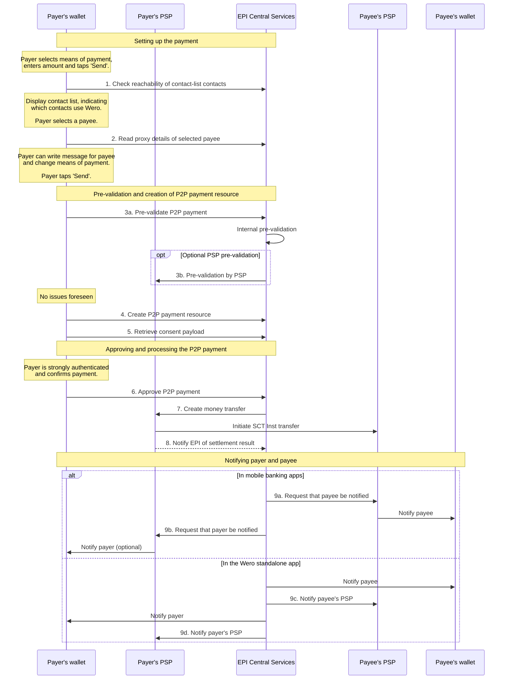

```mermaid
sequenceDiagram
    participant payer as Payer's wallet
    participant payer_psp as Payer's PSP
    participant epi as EPI Central Services
    participant payee_psp as Payee's PSP
    participant payee as Payee's wallet

    Note over payer,epi: Setting up the payment

    Note over payer: Payer selects means of payment,<br/>enters amount and taps 'Send'.
    payer->>epi: 1. Check reachability of contact-list contacts

    Note over payer: Display contact list, indicating<br/>which contacts use Wero.<br/><br/>Payer selects a payee.
    payer->>epi: 2. Read proxy details of selected payee

    Note over payer: Payer can write message for payee<br/>and change means of payment.<br/><br/>Payer taps 'Send'.

    Note over payer,epi: Pre-validation and creation of P2P payment resource

    payer->>epi: 3a. Pre-validate P2P payment
    epi->>epi: Internal pre-validation

    opt Optional PSP pre-validation
        epi->>payer_psp: 3b. Pre-validation by PSP
    end

    Note over payer: No issues foreseen

    payer->>epi: 4. Create P2P payment resource
    payer->>epi: 5. Retrieve consent payload

    Note over payer,epi: Approving and processing the P2P payment

    Note over payer: Payer is strongly authenticated<br/>and confirms payment.
    payer->>epi: 6. Approve P2P payment
    epi->>payer_psp: 7. Create money transfer
    payer_psp->>payee_psp: Initiate SCT Inst transfer
    payer_psp-->>epi: 8. Notify EPI of settlement result

    Note over payer,payee: Notifying payer and payee

    alt In mobile banking apps
        epi->>payee_psp: 9a. Request that payee be notified
        payee_psp->>payee: Notify payee

        epi->>payer_psp: 9b. Request that payer be notified
        payer_psp->>payer: Notify payer (optional)

    else In the Wero standalone app

        epi->>payee: Notify payee
        epi->>payee_psp: 9c. Notify payee's PSP

        epi->>payer: Notify payer
        epi->>payer_psp: 9d. Notify payer's PSP

    end
```
